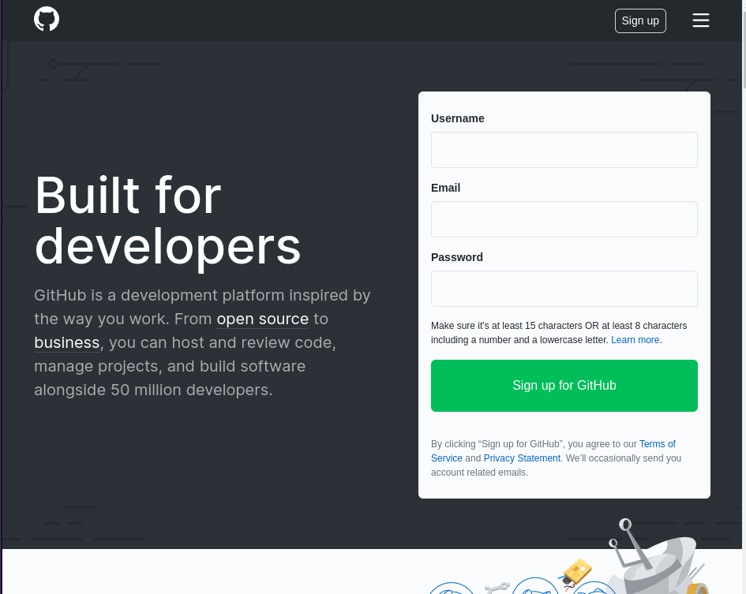
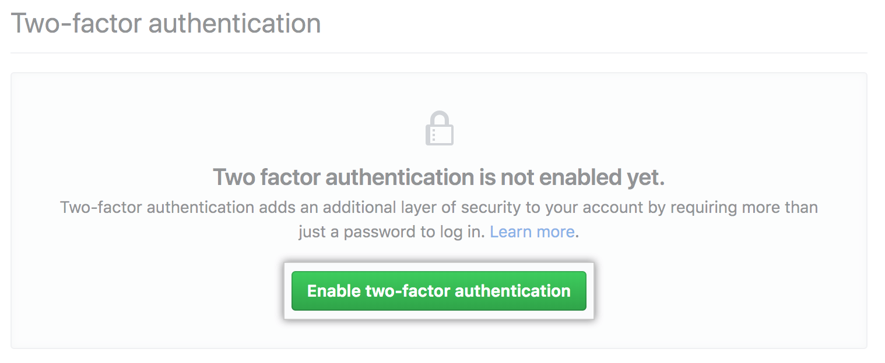
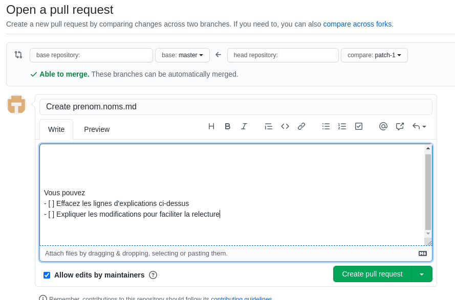

## Github c'est quoi ?

C'est un service en ligne qui contient le code source de plusieurs projets de l'ANS dont cette documentation.

Dans tous les cas, vous pouvez demander de l'aide par email sur `ans-forge@esante.gouv.fr`

Pour être ajouté à une équipe Github de l'ANS, vous pouvez remplir ce formulaire : [https://forms.office.com/e/Wzy2XUAEab](https://forms.office.com/e/Wzy2XUAEab)  

## Je crée un compte Github

* Inscrivez-vous sur le site de Github : [https://github.com/join](https://github.com/join)

* Valider votre compte Github en cliquant sur le lien reçu par email
* Pour améliorer la sécurité, vous devez activer l'authentification double facteur
  * Aller sur la page [https://github.com/settings/security](https://github.com/settings/security)
  * Dans la section "Two-factor authentication"
  * Cliquer sur "Enable two-factor authentication"

* Si vous êtes familier avec les applications mobile de type "Google Authenticator" faites : "**Set up using an app**." et suivre les étapes indiqués par Github.
* Si vous ne comprenez pas le point ci-dessus, faites "**Set up using SMS"** et entrer votre numéro de mobile
* Github va vous afficher des "Recovery codes"
  * Imprimer ces codes et sauvegarder les de manière sécurisée.

* Github doit vous proposez de saisir un code pour confirmer la procédure \(soit le code vous est envoyé par sms soit vous devez ouvrir l'application qui gére vos codes\)
* Mettre sa photo \(ou une image personnalisée si on ne veut pas diffuser ta photo\) sur Github, dans "Settings", "Profile" ou par le lien  [https://github.com/settings/profile](https://github.com/settings/profile)
  * \(Elle servira pour la page communauté\).

## Faire une modification sur un des projets

* Recherchez le repo github à modifier dans la liste des projets de l'ANS
* Faire un clone en local et effectuer les modifications dans une branche définie (avec un nom explicite qui traduit la feature)
* Faire un commit avec un nom également explicite précisant les modifications effectuées par ce commit
* Pousser la branche sur Github.
* Pour pouvoir merge les modifications, il faut faire une **"Create pull request"**
* Modifier la description pour et cliquer sur le nouveau bouton **"Create pull request"**

* Un autre membre du projet est requis pour relire et accepter les modifications.
